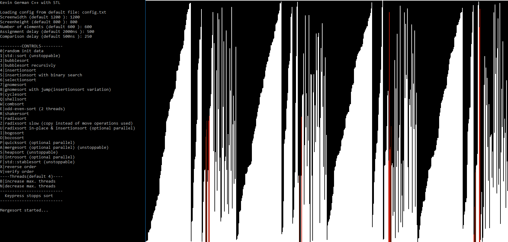
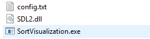
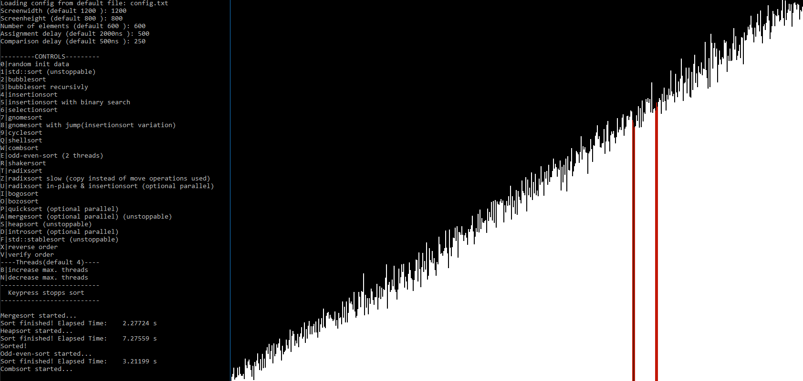
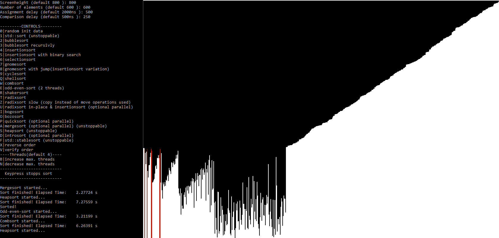
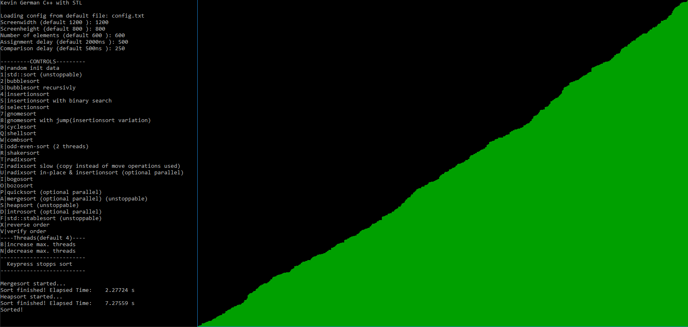

# SortVisualization
Visualization of different sorting algorithms with C++ and SDL

Features
--------
- Visualization of different sorting algorithms
- Configurable
  - Time to copy and to compare elements is configurable (simulate different data structures)
  - Number of elements
  - Screen resolution
- Optional multithreading
- Time measurement

Setup
-----

1) The configuration will be loaded during startup from "config.txt"
2) If config.txt is not available, the user will be asked to specify the configuration
- The user can specify a different file through parameters for example: SortVisualization.exe customConfig.txt

Config.txt
----------
1) Vertical screen resolution
2) Horizontal screen resolution
3) Number of elements
4) Copy/Assignment delay in ns
5) Compare delay in n

- Example:
  - 1200
  - 800
  - 1200
  - 500
  - 250

How to use
-----------
HOTKEY|FUNCTION
------|-------------------------
  0   |random init data
  1   |std::sort
  2   |bubble sort
  3   |bubble sort recursivly
  4   |insertio nsort
  5   |insertion sort with binary search
  6   |selection sort
  7   |gnome sort
  8   |gnome sort with jump (insertionsort variation)
  9   |cycle sort
  Q   |shell sort
  W   |comb sort
  E   |odd-even-sort (2 threads)
  R   |shaker sort
  T   |radix sort
  Z   |radix sort slow (copy instead of move operations used)
  U   |radix sort in-place & insertionsort (optional parallel)
  I   |bogo sort
  O   |bozo sort
  P   |quick sort (optional parallel)
  A   |merge sort (optional parallel) 
  S   |heap sort 
  D   |intro sort (optional parallel)
  F   |std::stablesort 
  X   |reverse order
  V   |verify order
  B   |increase max. threads (default 4)
  N   |decrease max. threads
  
  -> If a key is pressed, sorting will stop. (std::stablesort, std::sort and heapsort can not be stopped). 

Sorting Algorithms are used from my other Repo CPP_SortingAlgorithm_Templates
